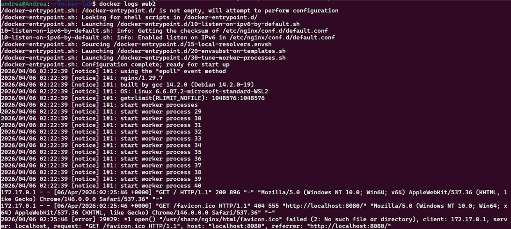
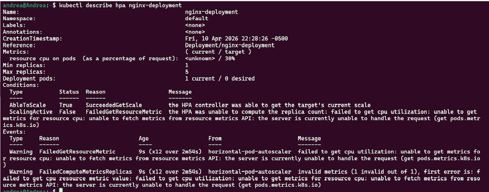

# AWS Containerization & Orchestration (EKS & Docker) 🐳☸️

Este repositorio documenta la transición de aplicaciones tradicionales a arquitecturas modernas basadas en microservicios, utilizando contenedores y orquestadores de grado empresarial.

---

## 🐳 1. Docker: Modernización de Aplicaciones
Creación y gestión de entornos aislados para aplicaciones.

* **Logros:**
    * Creación de **Dockerfiles** para la construcción de imágenes personalizadas.
    * Gestión del ciclo de vida de contenedores (Build, Run, Stop).
    * Uso de **Docker Hub** / **Amazon ECR** para el almacenamiento de imágenes.
    * Optimización de imágenes para entornos de producción.

> **Evidencia:**
> 

---

## ☸️ 2. Amazon EKS (Kubernetes)
Orquestación de contenedores a gran escala utilizando el servicio gestionado de AWS.

* **Habilidades demostradas:**
    * Despliegue de clústeres de **Amazon EKS**.
    * Configuración de nodos (Node Groups) y gestión de pods.
    * Uso de la herramienta de línea de comandos **kubectl** para interactuar con el clúster.
    * Implementación de **Deployments** y **Services** para la exposición de aplicaciones.
    * Escalado automático y gestión de alta disponibilidad.

> **Evidencia de Clúster EKS:**
> 

---

## 🛠️ Tecnologías Utilizadas
* **Containers:** Docker, Docker Compose.
* **Orquestación:** Kubernetes (K8s), Amazon EKS.
* **CLI Tools:** AWS CLI, kubectl, eksctl.
* **Registry:** Amazon ECR / Docker Hub.

---
*Este repositorio demuestra mi capacidad para manejar infraestructuras modernas y escalables basadas en microservicios.*
